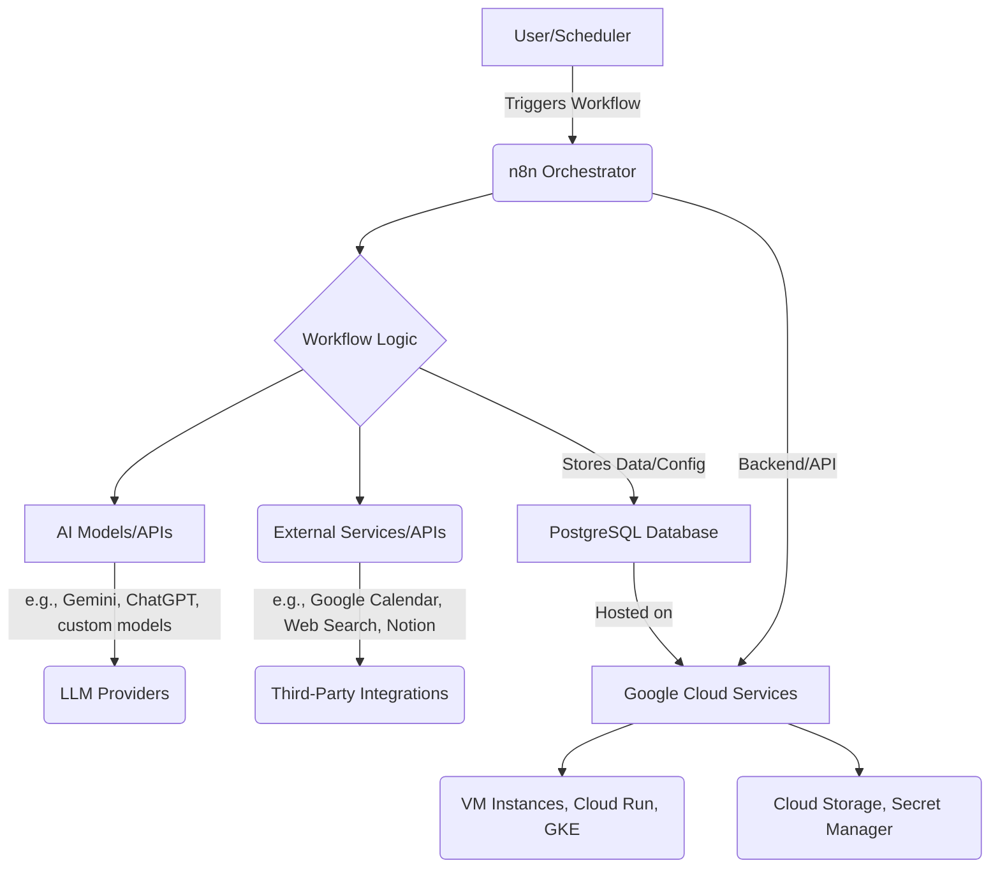

<!--
  Generated by AI-Powered README Generator
  Repository: https://github.com/GDSC-FSC/gdg-fsc-weekly-technical-25-26
  Generated: 2025-11-20T00:05:03.125Z
  Format: md
  Style: comprehensive
-->

# GDSC-FSC Technical Projects Collection
### Showcasing Innovation, Learning, and Practical Solutions

[](LICENSE)
[](https://github.com/GDSC-FSC/gdg-fsc-weekly-technical-25-26/actions)
[](https://github.com/GDSC-FSC/gdg-fsc-weekly-technical-25-26)
[](https://github.com/GDSC-FSC/gdg-fsc-weekly-technical-25-26/commits/main)

---

## 🧭 Table of Contents
- [GDSC-FSC Technical Projects Collection](#gdsc-fsc-technical-projects-collection)
  - [🧭 Table of Contents](#-table-of-contents)
  - [✨ Overview and Purpose](#-overview-and-purpose)
  - [🚀 Project Highlights](#-project-highlights)
    - [🧠 AI Study Workflow](#-ai-study-workflow)
    - [📄 Gemma OCR](#-gemma-ocr)
  - [🏗️ Architectural Overview](#️-architectural-overview)
    - [Overall Structure](#overall-structure)
    - [AI Study Workflow Architecture](#ai-study-workflow-architecture)
    - [Technology Stack](#technology-stack)
  - [🛠️ Getting Started](#️-getting-started)
    - [Prerequisites](#prerequisites)
    - [Installation Steps](#installation-steps)
      - [1. Clone the Repository](#1-clone-the-repository)
      - [2. Initialize Sub-Projects](#2-initialize-sub-projects)
    - [Configuration](#configuration)
  - [🚀 Usage & Workflows](#-usage--workflows)
    - [🧠 AI Study Workflow](#-ai-study-workflow-1)
    - [📄 Gemma OCR](#-gemma-ocr-1)
  - [🚧 Limitations, Known Issues & Future Roadmap](#-limitations-known-issues--future-roadmap)
    - [Current Limitations](#current-limitations)
    - [Known Issues](#known-issues)
    - [Future Roadmap](#future-roadmap)
  - [🤝 Contributing & Development Guidelines](#-contributing--development-guidelines)
    - [How to Contribute](#how-to-contribute)
    - [Branching & PR Guidelines](#branching--pr-guidelines)
    - [Code Style & Quality](#code-style--quality)
    - [Development Setup](#development-setup)
  - [📄 License, Credits & Contact](#-license-credits--contact)
    - [License](#license)
    - [Credits](#credits)
    - [Contact](#contact)
  - [📚 Appendix](#-appendix)
    - [Recent Updates / Changelog](#recent-updates--changelog)
    - [FAQ (Frequently Asked Questions)](#faq-frequently-asked-questions)
    - [Troubleshooting Guide](#troubleshooting-guide)

---

## ✨ Overview and Purpose

Welcome to the **GDSC-FSC Technical Projects Collection**! This repository serves as a showcase and collaborative space for various technical projects developed by the Google Developer Student Club at [FSC - *Faculty of Science Cairo University, or similar*]. It encapsulates our members' efforts in tackling real-world problems, exploring new technologies, and fostering a culture of innovation and learning.

The primary goal of this repository is to:
*   **Showcase diverse technical skills**: From AI-powered automation to machine learning applications.
*   **Provide practical solutions**: Address common challenges faced by students and researchers.
*   **Facilitate learning and collaboration**: Serve as a resource for members to learn from existing projects and contribute to new ones.
*   **Document best practices**: Offer well-structured and documented codebases for future reference.

This collection is aimed at GDSC members, students, developers interested in AI/ML and automation, and anyone looking for practical examples of modern software development.

[⬆️ Back to Top](#gdsc-fsc-technical-projects-collection)

---

## 🚀 Project Highlights

This repository currently hosts two distinct, powerful projects designed to enhance productivity and explore advanced AI capabilities.

### 🧠 AI Study Workflow

The **AI Study Workflow** is a comprehensive, automated system designed to assist students and researchers in their study and research processes. Leveraging orchestration tools like `n8n` and cloud services, it automates repetitive tasks, generates study materials, and helps manage academic schedules.

<details>
<summary>🔍 Click to expand AI Study Workflow Features</summary>

*   **Automated Note-Taking:** Automatically processes and summarizes lecture notes or research papers.
*   **Quiz Generation:** Creates quizzes based on provided study material, aiding active recall.
*   **Research Helper:** Assists in finding relevant information and synthesizing research findings.
*   **Schedule Management:** Integrates with calendars to help organize study sessions and deadlines.
*   **Practice Problem Finder:** Identifies and suggests practice problems related to specific topics.
*   **Web Search Integration:** Enhances information retrieval for study and research tasks.

> [!TIP]
> This project is ideal for students looking to streamline their academic workload and integrate AI into their daily study routines.
</details>

### 📄 Gemma OCR

The **Gemma OCR** (Optical Character Recognition) project focuses on extracting text from images and documents using advanced machine learning models, potentially leveraging the capabilities of Gemma, Google's open models. This project aims to provide accurate and efficient text recognition for various applications.

<details>
<summary>🔍 Click to expand Gemma OCR Features</summary>

*   **Image-to-Text Conversion:** Accurately extracts text from scanned documents, images, and PDFs.
*   **Model Training Module:** Includes scripts and configurations for training custom OCR models.
*   **Prediction API:** Provides a straightforward interface for performing OCR on new inputs.
*   **Data Preprocessing Pipeline:** Robust tools for preparing image data for model training and inference.
*   **Performance Evaluation:** Tools for assessing the accuracy and efficiency of the OCR models.

> [!NOTE]
> This project is particularly useful for developers, data scientists, and researchers working with document processing, data extraction, or accessibility solutions.
</details>

[⬆️ Back to Top](#gdsc-fsc-technical-projects-collection)

---

## 🏗️ Architectural Overview

This section provides a high-level overview of how the projects within this repository are structured and the technologies they utilize.

### Overall Structure
This repository serves as a monorepo-like structure, housing independent projects under the `projects/` directory. Each project maintains its own isolated environment, documentation, and specific dependencies, allowing for modular development and deployment.

```
gdsc-fsc-gdg-fsc-weekly-technical-25-26/
├── dsa/                     # Data Structures & Algorithms exercises (placeholder)
├── projects/
│   ├── ai-study-workflow/   # AI-powered study automation project
│   └── gemma_ocr/           # OCR project using Gemma or similar models
└── README.md
└── LICENSE
```

### AI Study Workflow Architecture

The `AI Study Workflow` project integrates several components to create a robust automation system. The core orchestration is handled by `n8n`, an open-source workflow automation tool, backed by a PostgreSQL database. Cloud services, specifically Google Cloud, are used for deployment and additional capabilities.



> [!NOTE]
> The `AI Study Workflow` is designed to be highly extensible, allowing easy integration of new AI models, APIs, and third-party services via `n8n` nodes.

### Technology Stack

This collection leverages a diverse set of technologies:

*   **Core Languages:** Python (for Gemma OCR, scripts), Bash (for setup/deployment scripts).
*   **Orchestration:** `n8n` (for AI Study Workflow automation).
*   **Database:** PostgreSQL (for AI Study Workflow data persistence).
*   **Cloud Platform:** Google Cloud Platform (GCP) - VM Instances, Cloud Run, Cloud SQL, Secret Manager (for AI Study Workflow deployment).
*   **Machine Learning:** PyTorch/TensorFlow (implied by `gemma_ocr` structure), Hugging Face models (potential for Gemma OCR).
*   **Containerization:** Docker, Docker Compose (for local development and deployment of AI Study Workflow).
*   **Documentation:** Markdown, MkDocs (for Gemma OCR's internal documentation).

[⬆️ Back to Top](#gdsc-fsc-technical-projects-collection)

---

## 🛠️ Getting Started

To get started with the projects in this repository, follow the general installation steps below. For detailed instructions specific to each project, please refer to their respective `GETTING_STARTED.md` or `README.md` files.

### Prerequisites

Ensure you have the following software installed on your system:

*   **Git**: For cloning the repository.
    *   `git --version` (should be v2.25 or higher)
*   **Docker & Docker Compose**: Essential for running the `AI Study Workflow` locally.
    *   `docker --version`
    *   `docker compose version`
*   **Python**: Version 3.9+ for `Gemma OCR` development and scripts.
    *   `python --version`
*   **Google Cloud CLI (gcloud)**: Required for deploying the `AI Study Workflow` to GCP.
    *   `gcloud --version`
*   **`make`**: For `Gemma OCR` (optional, but helpful for development tasks).
    *   `make --version`

### Installation Steps

#### 1. Clone the Repository

First, clone this entire repository to your local machine:

```bash
git clone https://github.com/GDSC-FSC/gdg-fsc-weekly-technical-25-26.git
cd gdg-fsc-weekly-technical-25-26
```

#### 2. Initialize Sub-Projects

Navigate into the `projects/` directory and follow the instructions for each specific project you wish to set up.

<details>
<summary>🧠 AI Study Workflow - Quick Setup</summary>

Navigate to the `ai-study-workflow` directory:

```bash
cd projects/ai-study-workflow
```

For detailed setup, including Docker, database, and n8n configuration, refer to its dedicated documentation:
*   [**AI Study Workflow - GETTING_STARTED.md**](projects/ai-study-workflow/GETTING_STARTED.md)
*   [**AI Study Workflow - QUICKSTART.md**](projects/ai-study-workflow/QUICKSTART.md)

**Quick Local Setup (Docker Compose):**

1.  **Copy Environment Variables:**
    ```bash
    cp config/.env.example config/.env
    # Edit config/.env to set your desired N8N_HOST, POSTGRES_DB, etc.
    ```
2.  **Start Services:**
    ```bash
    docker compose -f config/docker-compose.yml up -d
    ```
3.  **Access n8n:**
    Open your browser and navigate to `http://localhost:5678` (or the `N8N_HOST` you configured).

</details>

<details>
<summary>📄 Gemma OCR - Quick Setup</summary>

Navigate to the `gemma_ocr` directory:

```bash
cd projects/gemma_ocr
```

For detailed setup, including environment creation and model training, refer to its dedicated documentation:
*   [**Gemma OCR - docs/getting-started.md**](projects/gemma_ocr/docs/getting-started.md)
*   [**Gemma OCR - README.md**](projects/gemma_ocr/README.md)

**Quick Local Setup:**

1.  **Install Python Dependencies:**
    ```bash
    pip install -r requirements.txt
    # or using poetry
    # poetry install
    ```
2.  **Basic Model Training (if desired):**
    ```bash
    python -m gemma_ocr.modeling.train --config config/default.yaml
    ```
3.  **Run Prediction (example):**
    ```bash
    python -m gemma_ocr.modeling.predict --image-path path/to/your/image.png
    ```

</details>

### Configuration

Each project has its own configuration mechanisms:

*   **AI Study Workflow:** Primarily uses environment variables (via `config/.env`) and `n8n` workflow settings. Refer to `projects/ai-study-workflow/config/.env.example` for available variables.
*   **Gemma OCR:** Utilizes `config.py` and YAML configuration files (e.g., `config/default.yaml`) for model parameters and data paths.

> [!IMPORTANT]
> Always review and secure sensitive information like API keys and database credentials. For production deployments, use secure secret management solutions (e.g., Google Secret Manager, HashiCorp Vault).

[⬆️ Back to Top](#gdsc-fsc-technical-projects-collection)

---

## 🚀 Usage & Workflows

This section provides a high-level overview of how to use each project. For comprehensive guides and detailed examples, please refer to the project-specific documentation.

### 🧠 AI Study Workflow

The `AI Study Workflow` is primarily driven through the `n8n` web interface or by triggering its exposed webhooks/APIs.

<details>
<summary>💡 Common AI Study Workflow Use Cases</summary>

1.  **Running a Quiz Generator Workflow:**
    *   Access the `n8n` dashboard (`http://localhost:5678`).
    *   Import the `quiz-generator.json` workflow from `projects/ai-study-workflow/workflows/`.
    *   Configure the workflow with your study material (e.g., a text input, URL, or document upload).
    *   Execute the workflow manually or set up a schedule/webhook trigger.
    *   The workflow will use an LLM to generate questions and answers, which can then be saved or presented.

2.  **Automating Note Summarization:**
    *   Import the `note-taking.json` workflow.
    *   Set up a trigger, e.g., watching a specific folder for new `.txt` or `.md` files.
    *   The workflow processes the new file, sends its content to an LLM for summarization, and saves the summary to another location or a Notion page.

> [!NOTE]
> Detailed examples and setup guides for each workflow (`note-taking.json`, `quiz-generator.json`, etc.) are available in the [AI Study Workflow - WORKFLOWS.md](projects/ai-study-workflow/docs/WORKFLOWS.md).
</details>

### 📄 Gemma OCR

The `Gemma OCR` project can be used for both training new OCR models and performing predictions on existing images.

<details>
<summary>📝 Common Gemma OCR Use Cases</summary>

1.  **Performing OCR on an Image:**
    ```bash
    # Ensure you are in the projects/gemma_ocr directory
    cd projects/gemma_ocr

    # If you have a trained model, specify its path. Otherwise, use a default/pre-trained one.
    python -m gemma_ocr.modeling.predict --image-path ../../references/sample_document.png --output-format text
    # This command will output the extracted text directly to the console.

    # You can also save the output to a file
    python -m gemma_ocr.modeling.predict --image-path ../../references/sample_invoice.jpg --output-file extracted_text.txt
    ```

2.  **Training a Custom OCR Model:**
    *   **Prepare your Dataset:** Organize your images and their corresponding ground truth text into the format expected by `gemma_ocr.dataset.py`.
    *   **Configure Training:** Modify a YAML configuration file (e.g., `config/custom_train.yaml`) to specify dataset paths, model parameters, and training hyperparameters.
    *   **Run Training:**
        ```bash
        cd projects/gemma_ocr
        python -m gemma_ocr.modeling.train --config config/custom_train.yaml
        ```
        The trained model checkpoints will be saved in the `models/` directory.

> [!IMPORTANT]
> The `projects/gemma_ocr/docs/getting-started.md` and `projects/gemma_ocr/docs/index.md` provide more in-depth examples and API usage.
</details>

[⬆️ Back to Top](#gdsc-fsc-technical-projects-collection)

---

## 🚧 Limitations, Known Issues & Future Roadmap

This section outlines current constraints, identified problems, and the planned evolution of the projects within this repository.

### Current Limitations

*   **Repository-wide:**
    *   Cross-project communication or integration is not explicitly defined, each project operates independently.
    *   Centralized logging/monitoring across all projects is not yet implemented.
*   **AI Study Workflow:**
    *   Reliance on external LLM providers (e.g., OpenAI, Google Gemini) means cost and rate limits are a factor.
    *   Scalability beyond single-user or small team usage requires further optimization and infrastructure scaling.
    *   Limited error handling and recovery for complex multi-step workflows.
*   **Gemma OCR:**
    *   OCR accuracy can vary significantly with image quality, font styles, and layout complexity.
    *   Support for non-Latin scripts might be limited without specific model training.
    *   Large document processing performance may require GPU acceleration.

### Known Issues

*   **AI Study Workflow - N8N Persistence:** If `n8n` Docker container is stopped without proper database connection, workflow data might be lost or corrupted if not properly backed up. Ensure `POSTGRES_DB` is correctly configured in `.env`.
    *   _Workaround:_ Always ensure your PostgreSQL database is running and accessible before starting `n8n`.
*   **Gemma OCR - Environment Conflicts:** Occasional dependency conflicts with other Python projects if not using isolated virtual environments.
    *   _Resolution:_ Always use a dedicated `venv` or `conda` environment for `gemma_ocr`.

### Future Roadmap

We are constantly working to improve and expand our projects. Here's a glimpse of what's planned:

*   **Repository-wide Enhancements:**
    *   **Centralized CI/CD:** Implement GitHub Actions for automated testing and deployment across all projects.
    *   **Shared Utilities:** Create a `utils/` directory for common helper scripts or libraries.
    *   **Consolidated Documentation Portal:** Explore MkDocs or similar to host all project documentation in one place.
*   **AI Study Workflow:**
    *   **Advanced LLM Integration:** Support for more diverse LLMs and fine-tuning options.
    *   **User Management & Dashboards:** Implement basic user management and an analytics dashboard within `n8n` or a custom frontend.
    *   **Cloud Agnostic Deployment:** Provide clearer guides and scripts for deployment on other cloud providers (Azure, AWS).
*   **Gemma OCR:**
    *   **Pre-trained Models:** Release pre-trained models for common use cases.
    *   **Batch Processing:** Add robust capabilities for processing multiple images/documents in a batch.
    *   **API Wrapper:** Develop a simple REST API wrapper for the OCR prediction service.
    *   **Integration with Document Layout Analysis:** Enhance accuracy by integrating with layout analysis tools.

> [!TIP]
> We welcome feature requests and ideas from the community! Please open an issue on GitHub to suggest new features.

[⬆️ Back to Top](#gdsc-fsc-technical-projects-collection)

---

## 🤝 Contributing & Development Guidelines

We welcome contributions from everyone! Whether it's reporting a bug, suggesting an improvement, or submitting a new feature, your help makes this project better.

### How to Contribute

1.  **Fork the repository:** Start by forking `gdsc-fsc/gdg-fsc-weekly-technical-25-26`.
2.  **Clone your fork:** `git clone https://github.com/YourUsername/gdg-fsc-weekly-technical-25-26.git`
3.  **Create a new branch:** For each new feature or bug fix, create a dedicated branch (e.g., `feature/add-new-workflow` or `bugfix/fix-ocr-parsing`).
4.  **Make your changes:** Implement your changes, ensuring they adhere to the project's code style and guidelines.
5.  **Test your changes:** Run relevant tests to ensure your changes work as expected and don't introduce regressions.
6.  **Commit your changes:** Write clear and descriptive commit messages.
    *   Example: `feat: Add new 'Daily Planner' workflow to AI Study Workflow`
    *   Example: `fix: Resolve OCR parsing error for multi-line headers`
7.  **Push your branch:** `git push origin your-branch-name`
8.  **Open a Pull Request (PR):** Submit a PR from your branch to the `main` branch of the upstream repository (`GDSC-FSC/gdg-fsc-weekly-technical-25-26`).

> [!NOTE]
> For substantial changes or new projects, please open an issue first to discuss your ideas with the maintainers.

### Branching & PR Guidelines

*   **Main Branch:** The `main` branch is always stable and deployable. All development work should be done on feature or bugfix branches.
*   **Feature Branches:** Prefix with `feat/` (e.g., `feat/new-api-integration`).
*   **Bugfix Branches:** Prefix with `bugfix/` (e.g., `bugfix/fix-login-error`).
*   **Documentation Branches:** Prefix with `docs/` (e.g., `docs/update-gemma-ocr-guide`).
*   **Pull Requests:**
    *   Ensure your PR title is descriptive and follows the Conventional Commits specification.
    *   Provide a clear description of your changes, why they are needed, and how they were tested.
    *   Link to any relevant issues.

### Code Style & Quality

*   **Python:** Adhere to PEP 8. Use linters like `flake8` or `black` (configured in `pyproject.toml` for `gemma_ocr`).
*   **Shell Scripts:** Ensure scripts are clear, well-commented, and robust.
*   **N8N Workflows:** Workflows should be clearly structured, commented within `n8n`, and exported JSON files kept tidy.
*   **Testing:** Write unit and integration tests where appropriate (e.g., in `gemma_ocr/tests/`).
*   **Documentation:** Update relevant documentation (`README.md`, project-specific docs) for any new features or changes.

### Development Setup

*   Refer to the [Getting Started](#️-getting-started) section for general setup.
*   Each project directory (e.g., `projects/gemma_ocr/`) might contain `Makefile` or `setup.sh` scripts for specific development tasks like running tests, linting, or building documentation.

[⬆️ Back to Top](#gdsc-fsc-technical-projects-collection)

---

## 📄 License, Credits & Contact

### License

This entire repository and its contents are released under the **Apache License 2.0**.
See the [LICENSE](LICENSE) file for full details.

```
                                 Apache License
                           Version 2.0, January 2004
                        http://www.apache.org/licenses/
```

### Credits

*   **GDSC-FSC (Google Developer Student Club - Faculty of Science, Cairo University)**: The primary maintainers and contributors of this repository.
*   **Individual Project Contributors:** Specific credits for each project can be found in their respective `README.md` files or commit history.
*   **Open Source Community:** We extend our gratitude to the open-source community for the tools and libraries that made these projects possible (n8n, PostgreSQL, Docker, various Python libraries).

### Contact

For general inquiries, collaboration opportunities, or questions about the GDSC-FSC, please reach out via:

*   **GitHub Issues:** For bug reports, feature requests, or project-specific discussions.
*   **GDSC-FSC Official Channels:** (e.g., social media links, email) - *[Placeholder: Add actual links when available]*

[⬆️ Back to Top](#gdsc-fsc-technical-projects-collection)

---

## 📚 Appendix

### Recent Updates / Changelog

<details>
<summary>Click to view recent updates</summary>

*   **v0.1.0 - Initial Release (YYYY-MM-DD)**
    *   Introduced `AI Study Workflow` with core automation functionalities.
    *   Launched `Gemma OCR` project for text extraction from images.
    *   Initial documentation and setup guides.
*   **Upcoming Releases:**
    *   Improved deployment scripts for `AI Study Workflow`.
    *   Enhanced model training capabilities for `Gemma OCR`.
    *   Addition of new workflow templates.

</details>

### FAQ (Frequently Asked Questions)

<details>
<summary>❓ General FAQs</summary>

**Q: Can I use these projects independently?**
A: Yes, each project under `projects/` is designed to be largely self-contained and can be set up and run independently.

**Q: How do I report a bug or suggest a feature?**
A: Please open an issue on the [GitHub repository](https://github.com/GDSC-FSC/gdg-fsc-weekly-technical-25-26/issues) and provide as much detail as possible.

**Q: What if I have trouble setting up a project?**
A: First, consult the project's specific `GETTING_STARTED.md` or `README.md` and troubleshooting guides. If the issue persists, open a GitHub issue.

</details>

<details>
<summary>🧠 AI Study Workflow FAQs</summary>

**Q: What is n8n?**
A: `n8n` is an open-source workflow automation tool that helps you connect apps and automate tasks without writing code. It's used here as the orchestrator for various AI-powered study workflows.

**Q: Can I use a different database instead of PostgreSQL?**
A: While `n8n` supports other databases, PostgreSQL is the officially recommended and tested solution for this project. Custom configurations might require adjustments to `docker-compose.yml` and `n8n` settings.

**Q: How do I add my own AI model to the workflows?**
A: You can use `n8n`'s HTTP Request nodes to connect to any API endpoint that serves your custom AI model. Alternatively, you can write custom `n8n` nodes in TypeScript/JavaScript if deep integration is required.

</details>

<details>
<summary>📄 Gemma OCR FAQs</summary>

**Q: Is "Gemma" a specific model or a general term here?**
A: The project name `Gemma OCR` indicates an intention or capability to leverage Google's Gemma family of models, or similar advanced architectures, for OCR tasks. The current implementation details within `modeling/` would confirm the specific models used.

**Q: What image formats are supported for OCR?**
A: Typically, PNG, JPEG, TIFF, and PDF are supported. The exact formats depend on the underlying libraries used (e.g., Pillow, OpenCV).

**Q: How can I improve OCR accuracy?**
A:
1.  **High-Quality Images:** Use clear, high-resolution images.
2.  **Preprocessing:** Apply image preprocessing techniques (denoising, binarization, deskewing).
3.  **Model Training:** Train a custom model on a dataset similar to your target documents.
4.  **Language-Specific Models:** Use models specifically trained for the language of your text.

</details>

### Troubleshooting Guide

<details>
<summary>Click to expand Troubleshooting Tips</summary>

*   **General:**
    *   **"Command not found"**: Ensure all [prerequisites](#prerequisites) are installed and correctly added to your system's PATH.
    *   **Permission Denied**: For shell scripts, ensure they are executable: `chmod +x your_script.sh`.
    *   **`git pull` conflicts**: Always try to `git pull` on `main` before creating a new branch or pushing changes to avoid conflicts.
*   **AI Study Workflow:**
    *   **`n8n` not starting**: Check Docker logs for the `n8n` container: `docker logs <n8n_container_id>`. Ensure no port conflicts (e.g., 5678 is free).
    *   **Database connection errors**: Verify PostgreSQL container is running, and the connection string/credentials in `config/.env` are correct. Check PostgreSQL logs for errors.
    *   **Workflow errors in `n8n`**: Use the "Execute Workflow" feature in `n8n` to step through the workflow and identify which node is failing. Check the error output for specific messages.
*   **Gemma OCR:**
    *   **Python dependency errors**: Ensure you're in the correct Python virtual environment (`source .venv/bin/activate`) and all packages from `requirements.txt` are installed.
    *   **Model loading errors**: Verify that the specified model path exists and the model file is not corrupted. Ensure the model was trained with compatible libraries.
    *   **Low OCR accuracy**: Review the [Gemma OCR FAQs](#-gemma-ocr-faqs) for tips on improving accuracy.

> [!WARNING]
> Always back up your data before attempting significant troubleshooting steps or configuration changes.

</details>

[⬆️ Back to Top](#gdsc-fsc-technical-projects-collection)